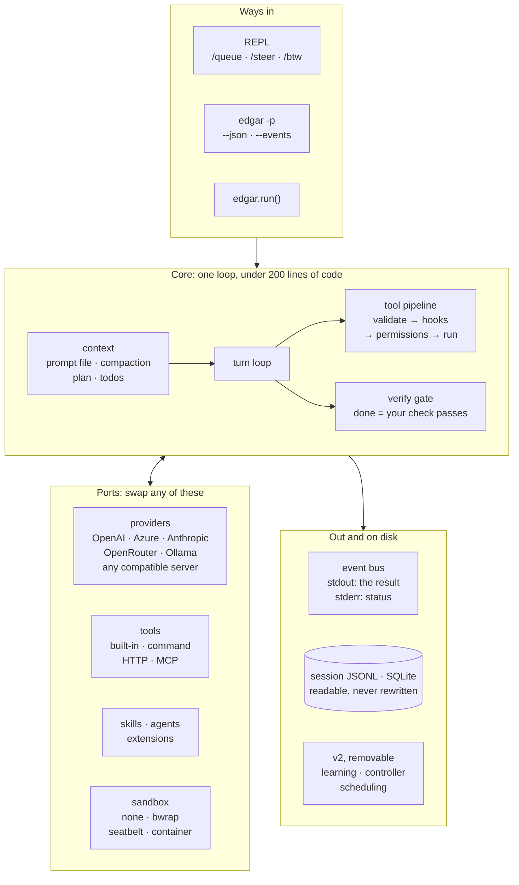

# edgar

**The agent harness you can read in an afternoon.**
Any model. No hidden calls. Nothing is done until it's verified.

**[Take A Tour of the Harness →](https://vespassassina.github.io/edgar/)** a guided read
of the code, stop by stop, with diagrams.

```bash
uvx edgar-harness                                # interactive
git diff | edgar -p "review this" --mode read-only
edgar -p "bump httpx and fix what breaks" --mode auto --verify "just check"
```

> **Status:** Core is built (M0 to M6): the REPL and one-shot runs against real
> models, with file, shell and web tools behind the permission engine, the verify
> gate, your own CLI and HTTP tools, skills, sessions you can resume
> (`edgar --continue`), compaction and cost caps. The 0.1 release to PyPI is next;
> until then, install from this repository. The documents in `docs/` are the spec
> being built against.

## Why edgar

- **Small enough to read.** The core is under 5,000 lines of code, with a size
  budget enforced in CI, and every file explains itself in plain comments, which
  are free. Fork it and change it without first learning 40,000 lines.
  [Take the tour](https://vespassassina.github.io/edgar/).
- **Any model.** OpenAI, Azure, Anthropic, OpenRouter, Ollama, or any
  OpenAI-compatible server as a config block, Google Vertex AI and Amazon Bedrock
  included. API keys, or your cloud sign-in with no key at all, never a vendor's
  subscription.
  Works with small local models too.
- **No hidden calls.** edgar never contacts a host you did not configure, has no
  telemetry, and its system prompt is a short file you can read and replace.
- **Done means verified.** A turn that changed something ends when your check
  passes, not when the model says it is finished.

## Quick start

```bash
uv tool install git+https://github.com/vespassassina/edgar   # PyPI from 0.1
export OPENAI_API_KEY=sk-...    # or ANTHROPIC_API_KEY, OPENROUTER_API_KEY
edgar login openrouter          # or sign in instead; the key is yours, kept in your keyring
edgar models                    # pick a model; Enter saves it as your default
edgar                           # the REPL, in the directory you are in
```

No API key? Install [Ollama](https://ollama.com), `ollama pull qwen3:8b`, and run
`edgar --model ollama/qwen3:8b`: everything stays on your machine.

Then give it your own tools and know-how, without Python. Copy a command tool, an
HTTP tool or a skill from [`examples/`](examples/) into `.edgar/`, and check what
edgar sees with `edgar tools list` and `edgar skills list`. The
[Cookbook](docs/COOKBOOK.md) has the recipes.

---

## What it is

edgar runs an LLM in a tool-using loop, in the directory you launched it from,
against OpenAI, Azure, Anthropic, OpenRouter, Ollama or any OpenAI-compatible
server. It has permissions, a verify-before-done gate, context compression,
custom tools for CLIs and APIs, skills, subagents, memory, MCP and extensions.

It ships in three tiers, each with a size budget in lines of code (blank lines and
comments don't count):

| Tier | What you get | Size |
|---|---|---|
| **Core** (0.x) | The loop, five providers, built-in and custom tools, skills, permissions, verify gate, staged compaction, sessions, REPL and pipes | ≤ 5,000 LOC |
| **v1.0** | Memory, MCP, subagents, routing and fallback, extensions and hooks, an embedding API. Extension formats frozen | ≤ 8,000 LOC |
| **v2.0** | Learning from what you type and what breaks, skill synthesis, a controller, a capability broker, scheduling | ≤ 11,000 LOC |

None of that is unusual. What is unusual is that the whole thing is small enough
to read in an afternoon, and the parts usually hidden behind an SDK are written
out plainly: how tool calls differ between providers, how compaction avoids
corrupting a transcript, how a permission decision is actually made.

It is a **teaching artifact first and a usable tool second**. Where those two goals
conflict, teaching wins. That trade is why some things are simpler than they could
be (SQLite FTS instead of embeddings) and some are stricter than they need to be
(a 150 ms startup budget enforced in CI).

### How it fits together



Everything outside the core plugs in through a port; the core imports none of the
adapters, and a test enforces that. The [Blueprint](docs/BLUEPRINT.md#1-architecture-at-a-glance)
has the module-level version.

## Why it exists

Agent harnesses come in two sizes. Toys that teach you nothing beyond a `while`
loop and a function call, and production systems whose complexity buries the
interesting parts. There is a gap in the middle: a harness that implements the
genuinely hard bits honestly, at a size a person can hold in their head.

## What it does

**Terminal-native.** Interactive REPL for daily use, `-p` for one-shot and pipes.
Result on stdout, status on stderr, real exit codes. Composes with the rest of
your shell. Keep typing while it works: plain text queues the next instruction,
`/steer` corrects the turn in flight, `/btw` asks a side question without
touching the conversation. `/pause`, `/undo` and `/retry` work the way you would
expect, and every one of them appends to the session record instead of rewriting
it.

**Your tone, not ours.** The shipped system prompt has no style opinions. Put
yours in `~/.edgar/personality.md` (or per project in `.edgar/personality.md`):
terse or chatty, which language, how much to explain. It can shape how edgar
talks, never what it is allowed to do.

**Five providers, two adapters, any compatible server.** OpenAI, Azure, OpenRouter
and Ollama share one OpenAI-compatible adapter driven by a quirks table; Anthropic
has its own. Any other OpenAI-compatible server is a config block. Anything else is
one module and one registry entry, or a provider plugin package.

```toml
# .edgar/config.toml
[model]
default = "lmstudio/qwen3-coder"

[providers.lmstudio]
kind = "openai-compatible"
base_url = "http://localhost:1234/v1"
```

`edgar models list` shows where each role's prompts go, every provider's endpoint
and whether its key is set, without contacting anything.

No API credit? `ollama pull qwen3:8b`, then `edgar --model ollama/qwen3:8b` runs
entirely on your machine for free. edgar does not sign in with a vendor
subscription: vendors keep those for their own apps
([ADR-0032](docs/adr/0032-oauth-keys-and-mcp.md)). Small local models that
fence their tool calls or write them as plain JSON are repaired, deterministically.

**Subagents with their own models.** Declared in markdown, not code. Run a cheap
local model for exploration and an expensive one for review, in parallel, each with
its own tool allowlist and budget.

**Model routing that isn't magic.** Declarative rules pick the model before the
turn, as a pure function with zero model calls. Escalation and fallback are kept
separate from routing and from each other, because "not capable enough" and "not
reachable" want different responses. Every switch is announced.

**Extend it without Python.** Give the agent a CLI with a command tool (an argv
template, never a shell) or an API with an HTTP tool (a request template with the
host fixed and secrets from the environment). Add MCP servers, skills in Claude's
`SKILL.md` format, subagents in markdown, and hooks that can veto a tool call.
Bundle any of it into an extension folder and share it by copying.

**Long sessions that stay valid.** Context is compressed in stages, cheapest
first: big outputs spill to disk, old tool results become stubs, old turns fold
into one summary. It never splits a tool call from its result, and the full record
stays on disk.

**Memory that stays trustworthy.** Hand-authored instructions and machine-learned
facts live in separate places, on purpose. Only what you type, or an error the
harness classified itself, becomes a fact. When the model wants to remember
something, it asks you first. Tool output and web pages never reach memory.

**Safe to point at a repo you just cloned.** Project hooks, MCP servers and tools
run only after you trust the project. The agent cannot edit its own config without
asking, and `auto` mode tightens after it reads untrusted content.

**A controller that cannot hurt you** (v2). Deterministic checks after each turn;
a cheap model runs only when one trips. It returns typed proposals from a fixed
whitelist, dry-run by default, fully logged, and it can only ever tighten policy.
It cannot write your instruction files — it proposes a diff and you apply it.

**Every call answers to what you asked** (v2). Scope a request (`--scope
paths=reports/q3.md`) and a line hidden in that report cannot send the agent to
another file or host: calls outside the scope are refused, and subagents inherit
the scope narrowed, never widened. Every allow and refusal goes into a signed
receipt tied to the words you typed; `edgar receipt --refused` shows what the agent
tried and was refused.

**Scheduling without a daemon** (v2). One `tick` command plus one host cron entry.
Agents can schedule themselves, with guardrails.

**Easy to build on.** `-p --json` for one result, `-p --events` for the live event
stream as JSON Lines, and `edgar.run()` from Python. No daemon, no HTTP API.

## What it deliberately is not

No MCP server mode. No daemon or HTTP API. No vector store. No multi-user. No GUI.
No race to support fifty providers. The full list with reasoning is in
[PRD §5.2](docs/PRD.md#52-explicit-non-goals), written down so scope creep has
something to argue with.

## Documentation

| | |
|---|---|
| [A Tour of the Harness](https://vespassassina.github.io/edgar/) | A guided read of the code, stop by stop, with diagrams ([source](docs/tour/index.html)) |
| [PRD](docs/PRD.md) | What it does and why, numbered requirements |
| [Blueprint](docs/BLUEPRINT.md) | Architecture, module map, data model, interfaces |
| [ADRs](docs/adr/) | Decisions, with the alternatives that were rejected |
| [Decisions](docs/DECISIONS.md) | The v0.3 and v0.4 revisions in one page: tiers, context, memory, extensions, security, ports |
| [Field review](docs/research/hn-2026-09.md) | What 11,647 Hacker News comments say about agent harnesses |
| [Cookbook](docs/COOKBOOK.md) | Recipes: a local model, pipes, your own tools and skills, a check that decides done |
| [Roadmap](docs/ROADMAP.md) | Eighteen milestones in three tiers, each one shippable |
| [Testing](docs/TESTING.md) | How you test something nondeterministic |
| [Brainstorm](docs/BRAINSTORM.md) | The original design conversation |
| [AGENTS.md](AGENTS.md) | Instructions for AI agents working on the code |

## Reading the source

[A Tour of the Harness](https://vespassassina.github.io/edgar/) walks the code
stop by stop, with diagrams, one part per tier. The short version:

1. `core/message.py` and `core/units.py` — the vocabulary and the invariant
2. `core/loop.py` — the whole thing in under 200 lines of code
3. `tools/base.py` and `tools/execute.py` — the contract and its pipeline
4. `permissions/policy.py` — one pure function
5. `context/compact.py` — where the subtlety is
6. `tools/custom.py` — command and HTTP tools
7. `providers/routing.py` — the same shape as permissions, deciding models instead of access

## Licence

[AGPL-3.0-or-later](LICENSE). Use it, fork it and change it freely. If you
distribute a modified edgar, or run one as a service for others, you share your
changes under the same licence. The reasoning is in
[ADR-0026](docs/adr/0026-licence-agpl.md).
