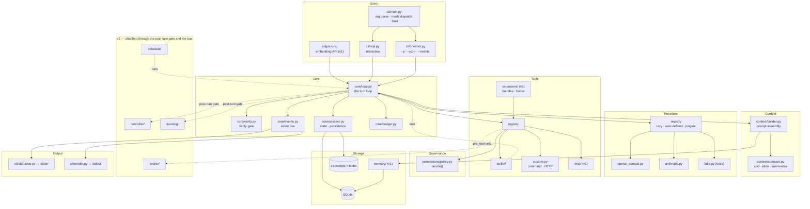
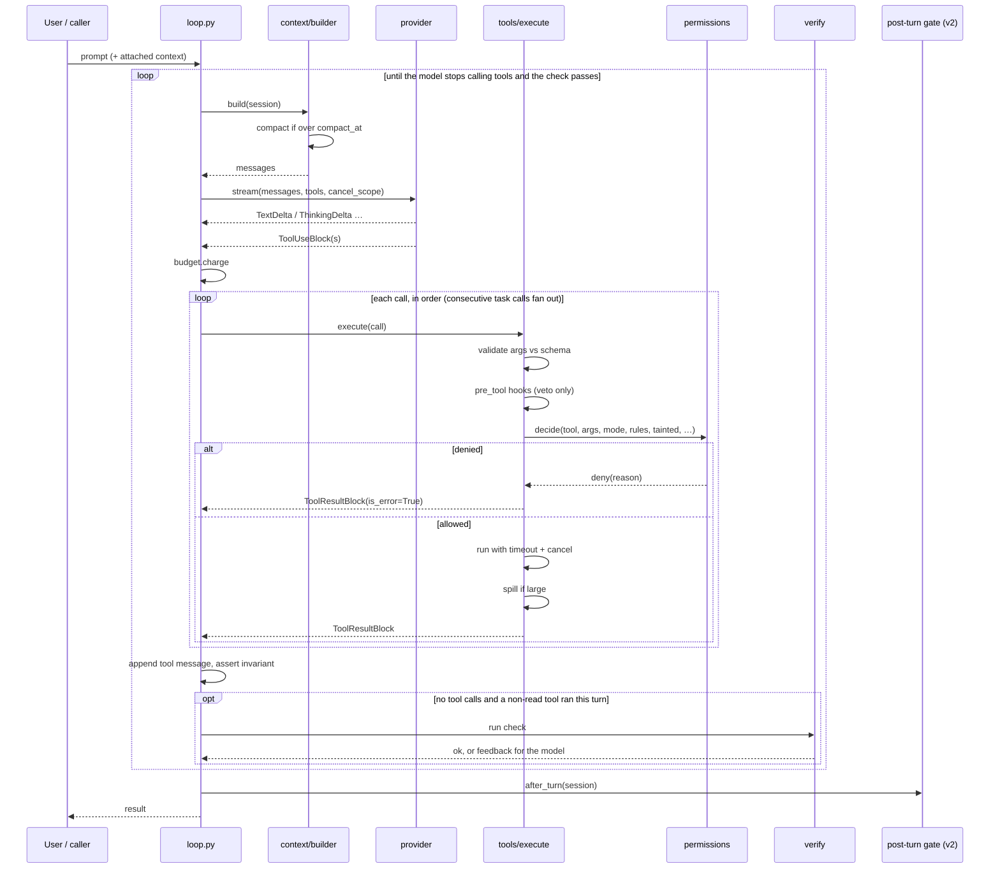
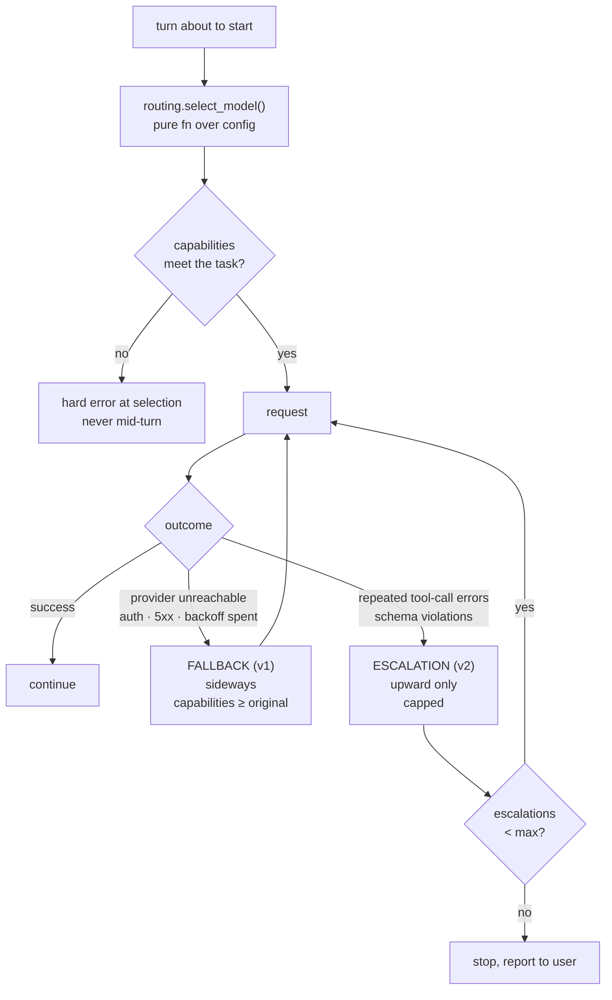
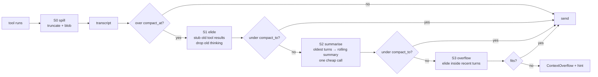
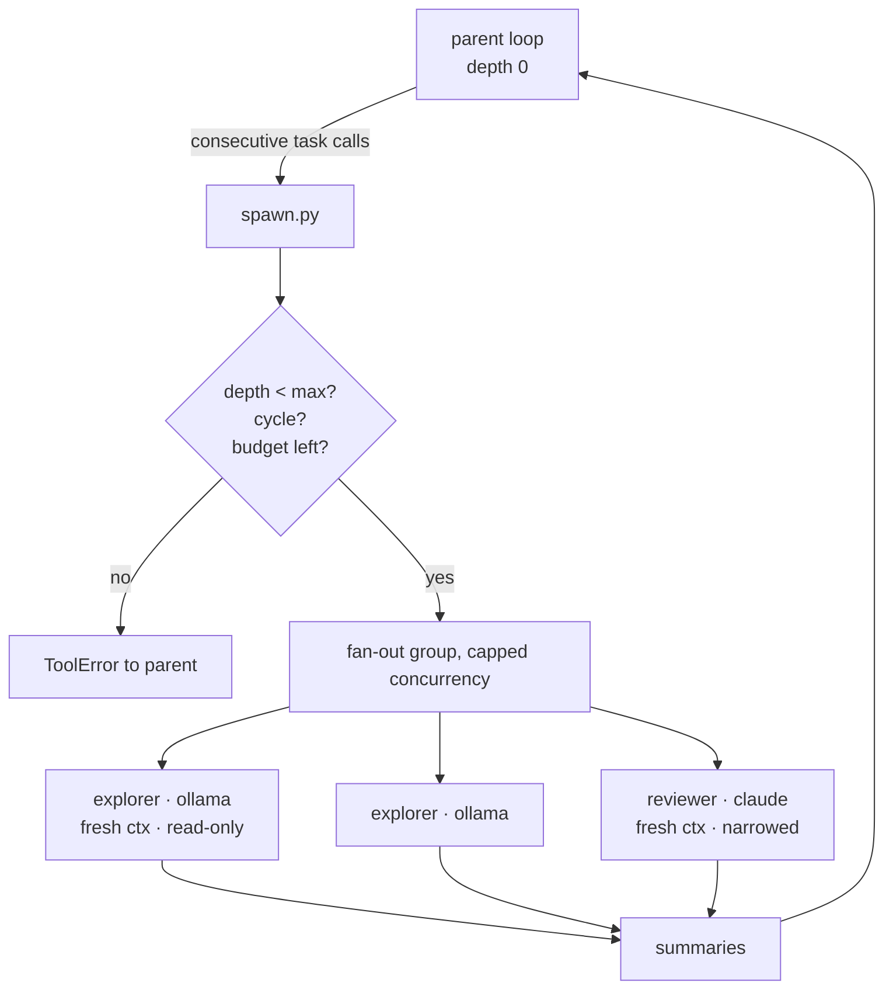
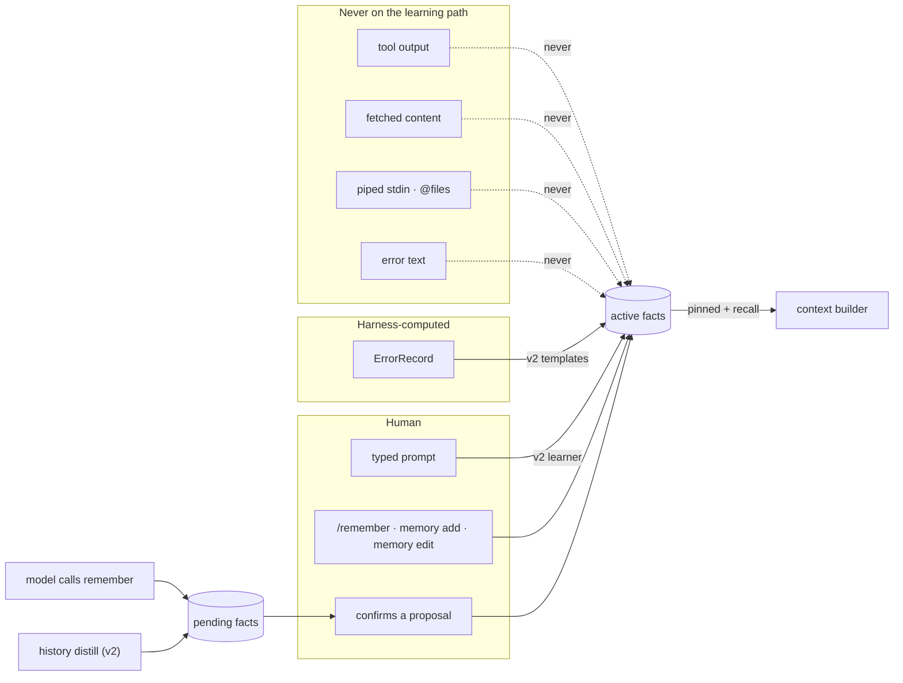
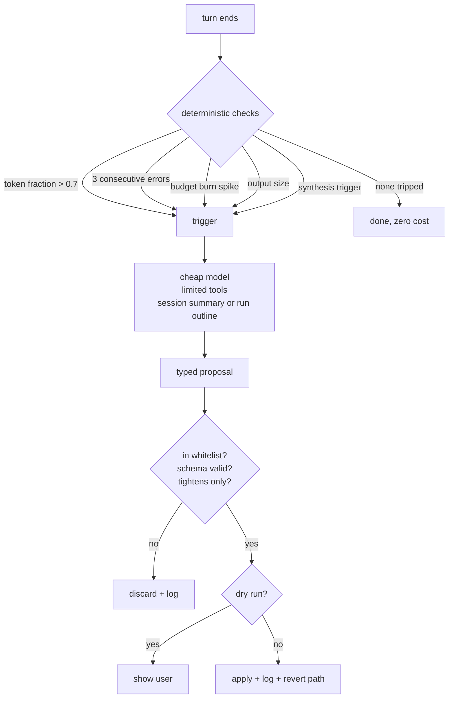
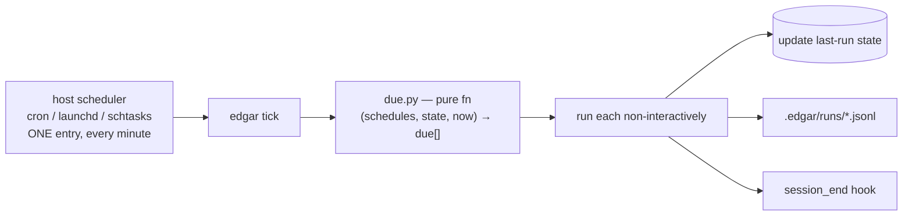

# edgar — Technical Blueprint

Architecture, data model and interfaces. Read [PRD.md](PRD.md) first for what and
why; this document is how. [DECISIONS.md](DECISIONS.md) summarises what changed in
v0.3 and v0.4 and why; [research/hn-2026-09.md](research/hn-2026-09.md) is the field
review behind v0.4.

Requirement IDs in brackets, e.g. `[TOOL-2]`, trace back to the PRD. Tier markers
**(v1)** and **(v2)** show where a module lands ([ADR-0015](adr/0015-release-tiers.md));
anything unmarked is Core.

---

## 1. Architecture at a glance



The `task` tool re-entering `loop.py` is the subagent mechanism. There is no
separate subagent engine; a subagent is the same loop with a different config, a
fresh transcript and a narrowed policy. That is deliberate: one loop to understand,
one loop to test.

**The tier seam.** v2 packages (`controller/`, `learning/`, `schedule/`, `broker/`,
`providers/escalation.py`) are never imported by Core or v1 code [NFR-12]. The loop
exposes a post-turn gate, a list of async callables, and the tool pipeline a list
of `pre_tool` veto callables; `cli/main.py` fills both by importing v2 packages by
name with `importlib`, only when config enables them.
Telemetry and history are event-bus subscribers. Deleting the v2 packages leaves a
working v1, and a CI job proves it.

**Ports and adapters.** The core (`core/`, `context/`, `permissions/`,
`tools/execute.py`) imports no adapter; adapters import only core types. Everything
outside the core plugs in through a port, with built-in adapters in the same
distribution and third-party ones through entry points
([ADR-0022](adr/0022-ports-and-adapters.md), EXT-11):

| Port | Built-in adapters | Third-party | Tier |
|---|---|---|---|
| Provider | `openai_compat`, `anthropic`, `fake` | config block; `edgar.providers` | Core; plugins v1 |
| Tool source | built-in, command, HTTP, MCP | TOML files; MCP servers | Core; MCP v1 |
| Skill source | `SKILL.md` folders, extensions | files | Core |
| Sandbox | `none`, `bwrap`, `seatbelt`, `container` | `edgar.sandboxes` | v1 |
| Retriever | `fts5` | `edgar.retrievers` | port v1; plugins v2 |
| Output | renderer, status line, `--json`, `--events` | `edgar.run()` subscribers | Core |

Session storage and the permission engine are deliberately not ports: the JSONL
format is part of edgar's openness, and a pluggable security boundary is not one.

## 2. Package layout

```
edgar/
├── src/edgar/
│   ├── __init__.py                 run() embedding API (v1) [EXT-9]
│   ├── __main__.py                 python -m edgar
│   │
│   ├── cli/
│   │   ├── main.py                 arg parsing, mode dispatch, exit codes, v2 gate loading
│   │   ├── setup.py                config and runtime, shared by -p and the REPL
│   │   ├── repl.py                 Shell (queue, /steer, /btw, /stop) + the prompt_toolkit wiring
│   │   ├── oneshot.py              -p mode, stdin attachment, --json, --events
│   │   ├── slash.py                slash command dispatch (§4.5)
│   │   ├── models.py               `edgar models [list]`, the model picker [CLI-30]
│   │   ├── render.py               line-at-a-time printing, notices, --events lines
│   │   ├── statusbar.py            status line: REPL toolbar, or one stderr line with -p
│   │   ├── prompt_ui.py            permission and fact prompts, one queue for all agents
│   │   └── trust.py                project trust prompt and `edgar trust`
│   │
│   ├── core/
│   │   ├── loop.py                 ★ the turn loop. Read this first.
│   │   ├── message.py              canonical Message / ContentBlock / ErrorRecord
│   │   ├── units.py                ★ unit grouping and the pairing invariant
│   │   ├── session.py              session state, resume, persistence
│   │   ├── events.py               event bus + event types
│   │   ├── verify.py               ★ verification gate
│   │   ├── aside.py                /btw: side request, no tools, outside the transcript
│   │   ├── budget.py               token + cost accounting, caps
│   │   ├── cancel.py               cancellation scopes
│   │   └── errors.py               error taxonomy → exit codes
│   │
│   ├── providers/
│   │   ├── base.py                 Provider protocol, capability declaration
│   │   ├── registry.py             model string → provider: built-in, user-defined, plugins (v1)
│   │   ├── routing.py              ★ pure select_model(): static roles, rules (v1)
│   │   ├── fallback.py             (v1) sideways on unavailability
│   │   ├── escalation.py           (v2) upward on capability failure
│   │   ├── openai_compat.py        OpenAI · Azure · OpenRouter · Ollama · user-defined
│   │   ├── anthropic.py
│   │   ├── http.py                 shared by both: retries, SSE, error mapping, token counts
│   │   ├── repair.py               deterministic tool-call repair [PRV-16]
│   │   ├── quirks.py               how providers differ, as data
│   │   ├── pricing.py              dated price table; unknown is None [BUD-5]
│   │   └── fake.py                 scripted provider for tests
│   │
│   ├── tools/
│   │   ├── base.py                 Tool protocol, ToolSchema, ToolResult
│   │   ├── registry.py             sources, collision resolution
│   │   ├── execute.py              ★ validate → pre_tool hooks → permission → run → spill
│   │   ├── spill.py                head/tail truncation and blobs (stage S0)
│   │   ├── custom.py               command and HTTP tools from TOML
│   │   ├── builtin/
│   │   │   ├── fs.py               read write edit ls glob grep
│   │   │   ├── shell.py            shell selection per platform
│   │   │   ├── fetch.py
│   │   │   ├── skill.py            loads a skill's body on demand [SKL-4]
│   │   │   ├── todo.py             the todo list [TOOL-14]
│   │   │   ├── tool_search.py      (v1) deferred schemas [TOOL-15]
│   │   │   ├── task.py             (v1) ★ spawns a subagent (re-enters loop)
│   │   │   ├── memory_tools.py     (v1) remember · recall
│   │   │   └── schedule_tools.py   (v2) schedule_self
│   │   └── mcp/                    (v1)
│   │       ├── client.py           JSON-RPC, discovery, lifecycle
│   │       ├── stdio.py
│   │       ├── http.py             Streamable HTTP
│   │       └── schema.py           MCP ↔ internal translation
│   │
│   ├── permissions/
│   │   ├── policy.py               ★ decide(): mode + rules + taint → decision
│   │   ├── matcher.py              path globs, shell segments, traversal defeat
│   │   ├── control.py              the control-file set and its hashes
│   │   ├── grants.py               interactive "always" grants in the DB
│   │   └── audit.py                decision log
│   │
│   ├── context/
│   │   ├── builder.py              ★ deterministic prompt assembly, byte-stable prefix
│   │   ├── compact.py              ★ staged compaction on whole units
│   │   ├── working.py              plan + todo: pinned working state [CTX-18]
│   │   ├── prompts.py              load shipped or project system prompt [CTX-16]
│   │   ├── tokens.py               counting, exact + approximate
│   │   └── pins.py                 what may never be compacted
│   │
│   ├── prompts/                    shipped as package data, not code
│   │   ├── system.md               base system prompt, ≤ 1,500 tokens [NFR-13]
│   │   └── compact.md              small-model profile [PRV-17]
│   │
│   ├── sandbox/                    (v1) the Sandbox port [PERM-15]
│   │   ├── base.py                 Sandbox protocol, detection
│   │   ├── none.py
│   │   ├── bwrap.py                Linux, bubblewrap
│   │   ├── seatbelt.py             macOS, sandbox-exec profile
│   │   └── container.py            Docker or Podman, any OS
│   │
│   ├── skills/
│   │   ├── discovery.py            frontmatter-only scan (yaml.safe_load); the
│   │   │                           `skill` tool loads a body (ADR-0041)
│   │   └── audit.py                (v1) conformance and danger rules, the report
│   │                               and the diff (ADR-0042)
│   │
│   ├── agents/                     (v1)
│   │   ├── definition.py           markdown + frontmatter parsing
│   │   ├── discovery.py            project > user > extensions
│   │   └── spawn.py                fan-out group, concurrency cap, depth guard
│   │
│   ├── extensions/                 (v1)
│   │   ├── manifest.py             extension.toml, validation
│   │   ├── discovery.py            project and user scope, enable/disable, ext add
│   │   └── hooks.py                hook matching, stdin JSON, veto semantics
│   │
│   ├── memory/                     (v1)
│   │   ├── store.py                the Fact model; SQLite facts, undo log, index (ADR-0045)
│   │   ├── retriever.py            the Retriever port [MEM-24]
│   │   ├── recall.py               built-in fts5 retriever over facts and sessions
│   │   ├── markdown.py             facts ↔ markdown round trip
│   │   └── redact.py               secret patterns
│   │
│   ├── learning/                   (v2)
│   │   ├── learner.py              autolearn from typed text only
│   │   ├── error_facts.py          ErrorRecord → templated facts
│   │   ├── history.py              history.md append, condense queue
│   │   ├── experience.py           run telemetry (a bus subscriber)
│   │   ├── synthesis.py            skill synthesis from the run outline
│   │   └── curator.py              optional skill curator
│   │
│   ├── controller/                 (v2)
│   │   ├── triggers.py             pure checks over session state
│   │   ├── proposals.py            the eight-action whitelist, schemas
│   │   └── apply.py                dry-run, apply, mutation log, revert
│   │
│   ├── schedule/                   (v2)
│   │   ├── parser.py               cron + interval shorthand
│   │   ├── due.py                  ★ pure due calculation
│   │   ├── tick.py                 run what is due
│   │   └── install.py              cron · launchd · Task Scheduler
│   │
│   ├── broker/                     (v2)
│   │   ├── caveats.py              the five caveats and their checks
│   │   ├── ticket.py               intents, tickets, attenuation, chain check
│   │   ├── authorize.py            ★ pure authorize(chain, request, uses, now)
│   │   └── receipt.py              hash-chained, HMAC-signed JSONL; replay
│   │
│   ├── config/
│   │   ├── schema.py               typed config model, hand-written validation
│   │   ├── load.py                 layering + provenance tracking
│   │   ├── paths.py                ~/.edgar and project paths
│   │   ├── init.py                 (v1) scaffolding from templates
│   │   └── doctor.py               (v1) environment checks
│   │
│   ├── storage/
│   │   ├── db.py                   connection, WAL, locking, migrations runner
│   │   ├── migrations/
│   │   └── transcript.py           JSONL read/write, compaction records
│   │
│   └── testing/
│       └── contract.py             (v1) provider contract kit for plugin authors [PRV-14]
│
├── tests/
├── docs/
├── examples/
├── AGENTS.md
├── README.md
└── pyproject.toml
```

Files marked ★ are the ones a reader should open first.
[A Tour of the Harness](https://vespassassina.github.io/edgar/) walks them in order.

## 3. Core data model

### 3.1 Messages

One canonical shape. Adapters translate to and from provider formats; nothing
outside `providers/` ever sees a provider-native structure. [PRV-5]

```python
# core/message.py
Role = Literal["system", "user", "assistant", "tool"]

@dataclass(frozen=True, slots=True)
class TextBlock:
    text: str
    attached: bool = False           # stdin or @file: context, never a learning source [CLI-3]

@dataclass(frozen=True, slots=True)
class ThinkingBlock:
    text: str
    origin: str                      # adapter family + model, e.g. "anthropic:claude-sonnet-5" [PRV-13]
    signature: str | None = None     # Anthropic verifies this on replay
    redacted: str | None = None      # opaque encrypted reasoning, replayed as given

@dataclass(frozen=True, slots=True)
class ToolUseBlock:
    id: str
    name: str
    args: dict[str, Any]
    malformed: str | None = None     # raw arguments that were not a JSON object even after
                                     # repair; the pipeline returns a validation error [PRV-16]

@dataclass(frozen=True, slots=True)
class ErrorRecord:                   # computed by the harness, never parsed from tool text [MEM-22]
    tool: str
    kind: ErrorKind                  # validation | permission_denied | timeout | not_found
                                     # | nonzero_exit | provider_http | cancelled
                                     # | internal (the tool itself raised)
    exit_code: int | None = None
    program: str | None = None       # argv[0] basename, [A-Za-z0-9._-] only

@dataclass(frozen=True, slots=True)
class ToolResultBlock:
    tool_use_id: str                 # MUST match a ToolUseBlock.id in the preceding message
    content: tuple[TextBlock, ...]
    is_error: bool = False
    truncated: bool = False
    untrusted: bool = False          # network-sourced: sets session taint [TOOL-13]
    error: ErrorRecord | None = None
    blob: str | None = None          # path of the spilled full output [CTX-13]

ContentBlock = TextBlock | ThinkingBlock | ToolUseBlock | ToolResultBlock

@dataclass(frozen=True, slots=True)
class Message:
    role: Role
    content: tuple[ContentBlock, ...]  # tuples, so frozen means immutable all the way down
    pinned: bool = False             # never compacted [CTX-5]
    meta: dict[str, Any] = field(default_factory=dict)
```

Frozen and slotted for two reasons: the compactor builds new lists rather than
mutating in place, which makes compaction naturally idempotent [CTX-8], and
immutability makes property testing straightforward.

**Units** (`core/units.py`). Compaction, the invariant check and the transcript
writer all work on units rather than messages
([ADR-0016](adr/0016-context-pipeline.md)):

- a message with no `ToolUseBlock`, or
- an assistant message with one or more `ToolUseBlock`s **plus the tool message
  immediately after it**

A **turn** is the sequence of units from a user message to the assistant message
that ends without tool calls.

**The invariant that governs compaction** [CTX-4]: every assistant message
containing tool calls is immediately followed by exactly one tool message, whose
result ids equal the call ids one-to-one. Thinking blocks inside the turn in
progress are never altered. Violating it produces a 400 from every provider. It is
asserted in `units.py`, tested as a property, and checked in debug builds before
every request. Because compaction only ever removes, stubs or summarises whole
units, the invariant holds by construction.

### 3.2 Events

The loop emits; the status bar, renderer, `--events` writer, telemetry, hooks and
logger subscribe. Decoupling here is what lets the same loop serve interactive,
piped, embedded, subagent and scheduled execution with different consumers
attached. [CLI-5, CLI-6, CLI-18, SUB-9]

```python
# core/events.py
class Event: ...                     # every event carries agent_id and depth

# lifecycle
SessionStarted(session_id, model, mode, trusted)
TurnStarted(turn_id, agent, model, depth)
TurnFinished(turn_id, usage, cost, reason)
SessionEnded(session_id, reason)

# provider
RequestStarted(provider, model, input_tokens)
TextDelta(text)
ThinkingDelta(text)
RequestFinished(usage, cost, cached)
ProviderRetry(attempt, after_s, reason)
ReasoningDropped(from_origin, to_family)          # [PRV-13]
ToolCallRepaired(tool, repair)                    # [PRV-16]

# routing [ADR-0013]
ModelSelected(model, rule, reason)
ModelFellBack(from_model, to_model, cause, reasoning_off)
ModelEscalated(from_model, to_model, trigger, escalation_count)   # v2

# tools
ToolProposed(id, name, args_preview)
HookRan(event, command, ok, vetoed)               # (v1)
PermissionRequested(id, tool, subject, rule)
PermissionResolved(id, decision, source)          # source: rule | mode | grant | hook | taint | control
ToolStarted(id, name)
ToolProgress(id, message)
ToolFinished(id, ok, duration_ms, truncated, blob)
SessionTainted(by_tool)                           # [PERM-11]
ToolsLoaded(names, via)                           # (v1) deferred schemas [TOOL-15]
SkillActivated(name, trigger)                     # (v1) [SKL-17]

# input during a turn [CLI-13, CLI-24]
InputQueued(text, position)
SteerApplied(turn_id, text)
Paused(turn_id)                                   # [CLI-27]
Resumed(turn_id)
TurnsUndone(count, files)                         # [CLI-26]
AsideStarted(question)
AsideFinished(answer, usage, cost)

# working state [CTX-18]
TodoUpdated(items)
PlanWritten(path)
SessionForked(parent_id, at_turn)                 # (v1) [CLI-22]

# verification [VER-6]
VerifyStarted(command, attempt)
VerifyFinished(ok, exit_code, attempt, duration_ms)

# subagents (v1)
SubagentStarted(id, name, model, task)
SubagentProgress(id, state)
SubagentFinished(id, ok, cost, summary_len)

# context and memory
ContextElided(units, tokens_freed)
CompactionStarted(before_tokens)
CompactionFinished(after_tokens, dropped, summary)
FactProposed(fact_id, text)                       # (v1) pending until confirmed [MEM-21]
FactSaved(fact_id, provenance)                    # (v1)
BudgetWarning(scope, used, cap)
Error(kind, message, recoverable)

# v2
ControllerTriggered(check, value, threshold)
ControllerProposal(action, reason, dry_run)
ControllerApplied(action, mutation_id)
ScopeRefused(tool, caveat, intent_id)             # the broker refused a call [CAP-6]
```

The bus is synchronous and in-process, roughly 40 lines. No queues, no threads.
Subscribers that need async work queue it themselves. The `--events` writer
serialises each event as one JSON line; the event names and fields above are part
of the 1.0 format freeze [EXT-10].

### 3.3 Session

```python
@dataclass
class Session:
    id: str                          # ULID, sortable
    cwd: Path                        # launch dir [CLI-16]
    created_at: datetime
    transcript: list[Message]
    agent: AgentDefinition
    model: str
    mode: PermissionMode
    budget: BudgetState
    config: Config                   # snapshot at session start [CFG-8]
    trusted: bool                    # project trust at start [PERM-13]
    tainted: bool = False            # sticky once set [PERM-11]
    depth: int = 0
    parent_id: str | None = None
    pending_steers: list[str] = field(default_factory=list)  # drained at the safe point [CLI-13]
```

Storage per [ADR-0010](adr/0010-session-storage.md): transcript as JSONL
(append-only, greppable, tailable), indices and state in SQLite. A reader can
`tail -f .edgar/sessions/<id>.jsonl` and watch a session happen, which is worth more
in a teaching repo than storage purity. Compaction appends a record rather than
rewriting (§8.3).

## 4. The turn loop

The single most important file. Kept under 200 lines of code by pushing every concern into
a collaborator. [CLI-1, CLI-2]



```python
# core/loop.py — shape, not final code
async def run_turn(session: Session, prompt: UserInput, rt: Runtime) -> TurnResult:
    bus.emit(TurnStarted(...))
    session.append(user_message(prompt))                # typed + attached blocks [CLI-3]
    provider = rt.provider                              # resolved lazily by the caller [PRV-4]
    attempts = 0

    while True:
        session.budget.assert_within()                  # raises → exit 6 [BUD-3]
        session.drain_steers()                          # the one safe point for /steer [CLI-13]
        messages = context.build(session)               # compacts if needed [CTX-3]
        response = await provider.stream(messages, tools=registry.schemas(), bus=bus)
        session.append(response.message)

        if response.tool_calls:
            results = await execute_in_order(response.tool_calls, session, bus)  # [TOOL-12]
            session.append(Message(role="tool", content=results))
            assert_pairing_invariant(session.transcript)                        # [CTX-4]
            continue

        if session.steers_pending():                    # model stopped, but the user steered
            continue
        check = await verify.gate(session, bus)         # None if no non-read tool ran [VER-2]
        if check is None or check.ok:
            break
        attempts += 1
        if attempts >= session.config.verify.max_attempts:
            return finish(session, bus, reason="verification_failed")          # exit 9 [VER-5]
        session.append(verify.feedback(check))          # back to the model [VER-3]

    for gate in POST_TURN_GATES:                        # empty unless v2 is enabled [NFR-12]
        await gate(session, bus)
    return finish(session, bus, reason="completed")
```

Everything interesting is behind one of those calls. That is the point.

### 4.1 Tool calls within one response

Calls run **in order**. A run of consecutive `task` calls is a fan-out group and
runs concurrently, capped by `subagents.max_parallel` [TOOL-12, SUB-5]. Sequential
execution keeps results deterministic and prompts readable; parallelism is kept
where it pays, in subagents, whose own tool calls are sequential inside each one.

Permission prompts from every agent go through one queue in `cli/prompt_ui.py` and
are asked one at a time, labelled with the agent's name. Parallel subagents never
interleave questions on stderr.

### 4.2 Verification gate

`core/verify.py`, [VER-1..7], [ADR-0014](adr/0014-verification-and-skill-synthesis.md).
The effective command comes from `--verify`, then the schedule entry, agent
frontmatter, loaded skills, then `verify.command` in config; the first source wins,
except that several loaded skills each run theirs in load order. The command is
authorised through `decide()` as a `shell` call **before the turn starts**, and a
command from project config also requires project trust [VER-4, PERM-13]. It runs
only when the turn used a non-read tool. Non-zero output is head/tail truncated and
returned as a message tagged as verification feedback.

### 4.3 Cancellation

Ctrl-C cancels the current scope [CLI-12, TOOL-10]. Before the session is saved,
every `ToolUseBlock` without a result gets
`ToolResultBlock(is_error=True, content=["cancelled by user"], error=ErrorRecord(kind="cancelled"))`.
A stream cut mid-generation keeps its partial text with `meta["interrupted"] = True`
and discards any partial tool call. The transcript always satisfies the invariant,
so `--resume` never meets a 400.

As built ([ADR-0035](adr/0035-repl-as-built.md)): cancellation is asyncio's. The
REPL cancels the task running the turn; `run_turn` catches the `CancelledError`,
calls `core/cancel.seal()`, emits `TurnFinished(reason="cancelled")` and re-raises.
Results that came in before the cancel are kept. Under `-p`, Ctrl-C does the same
and exits 7.

Queued and undelivered steered text goes back to the input line, unsent
[CLI-13].

### 4.4 Input during a turn

The REPL keeps reading input while a turn runs
([ADR-0028](adr/0028-input-during-a-turn.md)):

| Input | Where it goes |
|---|---|
| plain text, `/queue TEXT` | The REPL's FIFO queue. Each entry becomes its own turn when the current one finishes [CLI-13] |
| `/steer TEXT` | `session.steer(text)`: pending until the loop's safe point, then appended as a user message in the current turn [CLI-13] |
| `/btw TEXT` | `core/aside.py`: a side request, concurrent with the turn, outside the transcript [CLI-24] |

**One safe point.** `session.drain_steers()` runs at the top of each loop
iteration, before the next request is built. By then the previous iteration has
appended either a tool message answering every call or an assistant message with
no calls, so a steer always lands between complete units and the pairing
invariant holds without any special case. A steer that is pending when the model
stops keeps the turn going; the verify gate runs only once the model stops with
nothing pending. A steer typed after the turn has ended starts the next turn
instead.

The queue is the REPL's business, not the loop's: it only decides what the next
`run_turn` call receives. Steers live on the session because the loop consumes
them, but they are delivered there by the REPL, so the loop stays free of I/O.

**Provider translation.** A steer after a tool message gives two consecutive
user-role messages in Anthropic's format, which the API rejects. The Anthropic
adapter merges consecutive user-role content into one message, tool results first.
The OpenAI-compatible format accepts a user message after tool messages as is.

**Asides.** `aside.ask(session, question)` builds the same request `context.build`
would, cut back to the last complete unit (an assistant message whose calls have no
results yet is dropped from the snapshot), appends the question, and sends it with
no tools. The request shares the cached prefix. The answer is rendered as a
labelled block at the next boundary between output blocks, charged to the budget,
and written to the JSONL as its `AsideStarted` and `AsideFinished` event lines,
which replay skips.

### 4.5 Session commands

The REPL's session commands ([ADR-0029](adr/0029-session-commands.md), CLI-25..28)
follow one rule: **append a record, never rewrite one.** The prompt shows what the
records add up to; the JSONL keeps everything.

| Command | Record appended | Replay effect |
|---|---|---|
| `/reset` | `{"type": "reset"}` | messages before it are dropped from the prompt; model, mode, title and working state stay |
| `/undo N`, `/retry` | `{"type": "undo", "turns": N, "files": [...]}` | the last N turns are dropped; `files` lists what `write` and `edit` changed in them |
| `/title TEXT` | `{"type": "title", "text": "…"}` | the latest title wins |
| `/model NAME` | `{"type": "model", "model": "…"}` | the session continues on that model |

`/new` and `/clear` start a new JSONL; `/load ID` replays one, as `--resume ID`
does at startup. In v1 ([ADR-0037](adr/0037-core-fits-in-5000.md)), `/save` writes
the replayed session with blobs inlined to a single file that `/load` and
`edgar --load` accept. A turn runs from one typed prompt to the next, so
`/undo` always removes whole units and the pairing invariant holds without special
cases. Undo rewinds the conversation, never the disk (OQ-10).

**Pause** uses the steer safe point: `/pause` sets `session.paused`, and the loop,
where it drains steers, waits on it before building the next request. The request
or tool call in flight finishes first; nothing is cancelled. `/resume` clears the
flag; `/stop` cancels the turn as Ctrl-C does (§4.3).

**Titles** default to the first line of the first prompt, trimmed to 60 characters.
Never a model call (PRV-15).

## 5. Providers

### 5.1 Protocol

```python
# providers/base.py
class Provider(Protocol):
    name: str
    family: str                      # "openai-compatible" | "anthropic" | plugin-defined
    capabilities: Capabilities

    async def stream(
        self,
        messages: Sequence[Message],
        tools: Sequence[ToolSchema],
        *,
        model: str,
        bus: EventBus,
        reasoning: bool = True,      # False after a mid-turn family switch [PRV-13]
    ) -> ProviderResponse: ...       # message, usage, stop_reason, cost (None: unknown)

    def count_tokens(self, messages: Sequence[Message]) -> int: ...

@dataclass(frozen=True)
class Capabilities:
    tools: bool
    parallel_tool_calls: bool
    streaming: bool
    reasoning: bool
    prompt_caching: bool
    max_context: int
    max_output: int
```

Capabilities drive explicit degradation [PRV-10]. If a model cannot do tools, the
harness says so and refuses rather than silently producing a chat-only session that
appears broken.

Cancellation is asyncio's own: cancelling the task awaiting `stream()` closes the
HTTP response, and an adapter never swallows the `CancelledError`. `Usage` counts
every input token, cached ones included, and says when it is `approximate`
(the provider reported none) and how many tool calls needed `repairs`.

Both HTTP adapters share `providers/http.py`: one POST that retries 408, 409, 429,
5xx and 529 with full-jitter backoff before the first byte, and never after
(deltas have already gone out); `Retry-After` wins up to 60 s. Errors are mapped
with a hint: 401 and 403 name the key, a context-length 400 is `ContextOverflow`,
a refusal of tools names `native_tools = false` [PRV-7,
[ADR-0031](adr/0031-provider-layer-as-built.md)].

### 5.2 The quirks table

`openai_compat.py` serves four named providers and any user-defined one, because
the differences are data, not control flow. [PRV-3, ADR-0002]

```python
# providers/quirks.py
@dataclass(frozen=True, slots=True)
class Quirks:
    base_url: str | None             # None: the user must configure it (Azure)
    api_key_env: str | None = None   # None: no key sent
    base_url_env: str | None = None  # where else base_url may come from
    auth_style: Literal["bearer", "api-key", "none"] = "bearer"
    api_version: str | None = None   # Azure: ?api-version=, and the model is the deployment
    native_tools: bool = True        # False: tools described in text, calls parsed by repair.py
    parallel_tools: bool = False
    stream_usage: bool = False       # ask for usage in the final stream chunk
    max_context: int = 32_768
    max_output: int = 4_096
    max_tokens_param: Literal["max_tokens", "max_completion_tokens"] | None = None
    cost_source: Literal["table", "response", "free"] = "table"
    reasoning: bool = False          # the server streams reasoning text back

QUIRKS = {
    "openai":     Quirks("https://api.openai.com/v1", "OPENAI_API_KEY", parallel_tools=True, ...),
    "azure":      Quirks(None, "AZURE_OPENAI_API_KEY", base_url_env="AZURE_OPENAI_ENDPOINT",
                         auth_style="api-key", api_version="2024-10-21", ...),
    "openrouter": Quirks("https://openrouter.ai/api/v1", "OPENROUTER_API_KEY",
                         cost_source="response", reasoning=True, ...),
    "ollama":     Quirks("http://localhost:11434/v1", auth_style="none", max_context=8_192,
                         cost_source="free", reasoning=True, ...),
}
```

The defaults are the conservative ones, so a user-defined provider [PRV-12] only
states what it knows. Every key of a `[providers.NAME]` block is a quirk field
laid over the built-in row (or over the defaults for a new name), plus `kind`,
`thinking_budget` (Anthropic) and `prompt_profile`:

```toml
[providers.lmstudio]
kind = "openai-compatible"
base_url = "http://localhost:1234/v1"
api_key_env = "LMSTUDIO_API_KEY"     # optional
max_context = 32768                  # what the server really has
```

Tool support is not probed with a request of its own: tools go out with the
first request, and a server that refuses them becomes an error whose hint names
`native_tools = false`, which switches it to text tool calls
[ADR-0031](adr/0031-provider-layer-as-built.md). Ollama's window is set on the
server and it truncates silently past it, so its `max_context` should say what the
server has.

**Signing in without a key** (Core, PRV-20, [ADR-0044](adr/0044-keyless-cloud-sign-in.md)).
Azure (Entra ID), Google Vertex AI and Amazon Bedrock hand out short-lived tokens
through their own CLIs. `api_key_command` in a user-config block names that
command as an argv. `connect` runs it when the provider resolves, when no key is
set, and switches the row to bearer auth. The adapter holds a `Minted` token and
re-runs the command for any request once the token is ten minutes old. It runs
directly (never a shell) and never from project config, which fails to load if it
names one. No cloud SDK, no SigV4 and no OAuth client of edgar's own.

**GitHub Copilot** (v1, M8, PRV-19, [ADR-0043](adr/0043-github-copilot-provider.md))
is one more row, not a new adapter: a base URL, the headers Copilot requires, and a
token source of "keyring, from `edgar login github-copilot`" instead of an
environment variable. The login is GitHub's device flow under edgar's own OAuth
app, whose public client id sits in the row. Business and Enterprise plans override
`base_url` in `[providers.github-copilot]`. The row stays unreleased until
GitHub's terms are confirmed to allow direct use.

### 5.3 Lazy loading and plugins

NFR-1 is enforced structurally, not by discipline. [PRV-4, ADR-0012]

```python
# providers/registry.py
BUILTIN = {
    "openai": "edgar.providers.openai_compat",     "azure": "edgar.providers.openai_compat",
    "openrouter": "edgar.providers.openai_compat", "ollama": "edgar.providers.openai_compat",
    "anthropic": "edgar.providers.anthropic",      "fake": "edgar.providers.fake",
}
KINDS = {"openai-compatible": "edgar.providers.openai_compat",
         "anthropic": "edgar.providers.anthropic"}

def resolve(model_string, config=None, *, env=None, transport=None) -> tuple[Provider, str]:
    name, model = split(model_string)   # "openrouter/openai/gpt-5" → ("openrouter", "openai/gpt-5")
    # 1. built-in  2. [providers.NAME], by kind  3. entry point "edgar.providers" (v1)
    # A missing API key is a ConfigError here, before any request. `transport` is for tests.
    ...
```

No provider module, no `httpx`, no SDK is imported until a model string is
resolved. Entry points are read only when steps 1 and 2 miss, so plugins cost
nothing on the common path [PRV-14]. A CI test asserts that `import edgar.cli.main`
pulls in no provider module and no HTTP library [NFR-1].

### 5.4 Routing, fallback, escalation

Three mechanisms, deliberately separate, and now in three tiers: static role
binding in Core, routing rules and fallback in v1, escalation in v2.
[ADR-0013](adr/0013-model-routing.md)



| | Routing | Escalation | Fallback |
|---|---|---|---|
| **Question** | Which model starts this? | Not capable enough | Not reachable |
| **When** | Before the turn | Mid-session | Per request |
| **Direction** | n/a | Upward only | Sideways |
| **Trigger** | Declarative rules | Repeated failure | Provider error |
| **Cost** | Zero, pure function | A retry | A retry |
| **Tier** | roles Core, rules v1 | v2 | v1 |

```python
# providers/routing.py — pure, hence exhaustively testable [ROUTE-3]
def select_model(
    ctx: RoutingContext,
    rules: list[Route],
    defaults: ModelDefaults,
) -> Selection: ...

@dataclass(frozen=True)
class RoutingContext:
    role: Literal["main", "subagent", "controller", "condenser", "compactor"]
    agent: str | None
    mode: PermissionMode
    tools_required: bool
    prompt_tokens: int
    budget_remaining_fraction: float
    tags: frozenset[str]
    schedule: str | None

@dataclass(frozen=True)
class Selection:
    model: str
    rule: str            # matched rule name, or "default"
    reason: str          # rendered by `edgar route explain` [ROUTE-9]
```

Eight conditions, first match wins — the same evaluation shape as
`permissions.decide()`, so there is one pattern to learn rather than two.

Three guards that carry the weight:

- **Capability validation at selection** [ROUTE-6]. Routing a tool-requiring task
  to a tool-incapable model is a hard error before the request, not a confusing
  mid-stream failure.
- **Fallback preserves capabilities** [ROUTE-7]. Falling back mid-turn to a model
  without tool support produces a transcript the provider rejects and a session
  the user cannot resume.
- **Escalation is capped and announced** [ROUTE-5, ROUTE-10]. Uncapped, a
  struggling task walks the chain to the most expensive model and stays there.
  Unannounced, cost and behaviour become inexplicable.

`edgar route suggest` [ROUTE-12] (v2) mines experience telemetry and prints
candidate rules with their evidence. It never writes config.

### 5.5 Reasoning across providers

[PRV-13, ADR-0020](adr/0020-provider-portability.md). Each `ThinkingBlock` carries
its `origin`. When an adapter serialises a request it includes only thinking blocks
whose origin shares its family and drops the others, emitting one
`ReasoningDropped` per switch. Thinking blocks are never rewritten, merged or
re-signed.

When fallback or escalation changes family while a turn is in progress, the loop
passes `reasoning=False` to the new provider until the next user turn, so no
provider receives a tool-use turn missing its own reasoning block. Switches within
one family keep reasoning. Both cases are announced in the status line.

### 5.6 Small models: repair and profiles

Small local models are where a harness earns its keep: guardrails, tool errors
returned to the model and retries turn a model that fails half its tasks into one
that finishes them (research/hn-2026-09.md). Two mechanisms, both deterministic.

**Tool-call repair** (`providers/repair.py`, PRV-16). A fixed list of syntactic
repairs, tried in order, each a pure function: strip a surrounding code fence
(`fence`); drop text after a complete JSON object (`trailing-text`); accept a reply
that is one JSON object naming a known tool (`text-call`). The last applies to the
whole reply only, so a model explaining JSON is not calling a tool, except on
servers with `native_tools = false`, where tools travel in the system message on
the wire and a call may sit inside prose. Nothing semantic: no guessing argument
values, no fuzzy tool names. Arguments the list cannot repair stay on the call as
`malformed` and become a validation error returned to the model, the retry signal
models are trained on. Each repair emits `ToolCallRepaired` and counts in
`Usage.repairs`, so the rate is visible per model.

**Prompt profiles** (PRV-17). `compact` swaps `prompts/system.md` for
`prompts/compact.md`, exposes only Core built-ins unless configured otherwise, and
lowers `compact_at` and `compact_to` by 0.1, so short-context models compact
earlier. `auto` picks `compact` when `max_context` is under 32k
(`context/prompts.choose_profile`). A `[providers.NAME] prompt_profile` wins over
`[prompt] profile`.

### 5.7 No implicit models or hosts

[PRV-15, ADR-0023](adr/0023-no-hidden-behaviour.md). Auxiliary roles resolve in
`routing.py` to the main model unless config names another; there is no built-in
default model of any kind. The set of reachable hosts is a pure function of config
(provider base URLs, MCP server URLs, HTTP tool templates, `fetch` rules), which is
what `edgar doctor --network` prints. There is no telemetry, update check or remote
configuration.

## 6. Tools and extensions

Vocabulary and rationale in [ADR-0018](adr/0018-extension-model.md): a **tool** is a
function the model calls, a **skill** is instructions loaded on demand, an **agent**
is a subagent definition, a **hook** is a command on a lifecycle event, and an
**extension** bundles any of them.

### 6.1 Contract

MCP-shaped so the MCP client is a translation layer rather than a second system.
[TOOL-1]

```python
# tools/base.py
@dataclass(frozen=True)
class ToolSchema:
    name: str
    description: str
    input_schema: dict               # JSON Schema
    kind: Literal["builtin", "command", "http", "mcp"]
    origin: str                      # "builtin" | "project" | "user" | "ext:<name>" | "mcp:<server>"
    category: Literal["read", "write", "shell", "network", "memory", "agent"]
    read_only: bool = False          # human assertion for command/http tools [TOOL-6]
    untrusted_output: bool = False   # fetch, http, mcp [TOOL-13]
    dangerous: bool = False          # default to ask even in auto mode

class Tool(Protocol):
    schema: ToolSchema
    async def run(self, args: dict, ctx: ToolContext) -> ToolResult: ...

@dataclass(frozen=True)
class ToolResult:                    # what a tool returns; the pipeline builds the block
    text: str
    error: ErrorKind | None = None   # set when the tool itself reports failure

@dataclass(frozen=True)
class ToolContext:
    cwd: Path
    bus: EventBus
    blob_dir: Path                   # where spilled output goes [CTX-13]
    max_output_tokens: int
    timeout_s: float = 120.0         # [TOOL-3]
    # cancel: CancelScope joins in M4
```

A tool never sees the session: what it needs is passed in the context, so a tool
cannot reach the transcript, the policy or the provider.

### 6.2 Execution pipeline

Every call, every source, same path. [TOOL-2, TOOL-3, TOOL-4, TOOL-10]

```
validate args ─→ pre_tool vetoes ─→ permission check ─→ run with timeout+cancel ─→ spill ─→ result
      │                │                  │                      │
      └─ error         └─ veto            └─ denial              └─ timeout / exception
         all four return a ToolResultBlock(is_error=True, error=ErrorRecord(...))
         to the model, never an exception to the loop
```

The `pre_tool` stage runs hook commands (v1, §6.7) and in-process veto callables
registered at startup; the v2 broker is the only one that ships (§7.6). A veto
callable returns a refusal or `None`, never an allow.

Errors going back to the model rather than up the stack is deliberate: the model
frequently recovers from a bad argument or a denied path by trying something else,
and that recovery is a behaviour worth being able to observe. The `ErrorRecord` is
computed here, by the harness, from what it knows (tool, kind, exit code, program
name) and is the only error information the learning path ever sees (v2, MEM-22).

**Spill** (`tools/spill.py`, stage S0 of the context pipeline): output over
`tools.max_output_tokens` keeps its head and tail with a marker such as

```
[… 41,880 characters omitted. Full output: .edgar/sessions/01J9…/blobs/tu_07.txt — use read with offset …]
```

and the full text is written to that blob [CTX-13].

### 6.3 Sources and collisions

Resolution order on name collision, with a startup warning [TOOL-9]:

```
project custom  >  user custom  >  extensions (by name)  >  MCP  >  builtin
```

MCP servers spawn on first use, not at startup [TOOL-8], because a project with
five configured servers would otherwise pay five process launches on every
invocation and blow NFR-1 apart.

### 6.4 Command and HTTP tools

`tools/custom.py`, [TOOL-6]. Declared in TOML under `tools/` at either scope or in
an extension.

**Command tools** give the agent a specific CLI without the raw shell:

```toml
name = "gh_issue"
description = "Read a GitHub issue with the gh CLI."
argv = ["gh", "issue", "view", "{number}", "--json", "title,body,comments"]
timeout_s = 30
read_only = true
[input]
type = "object"
required = ["number"]
properties.number = { type = "integer" }
```

Validated arguments are rendered with `str()` and substituted as **whole argv
elements**; the process is started with `asyncio.create_subprocess_exec`, never a
shell. The permission subject is the rendered argv, matched like a shell command.

**HTTP tools** give the agent an API:

```toml
name = "service_status"
description = "Current status of a service."
method = "GET"
url = "https://status.example.com/api/v2/services/{service}"
headers = { Authorization = "Bearer ${env:STATUS_API_TOKEN}" }
body = { }                          # optional JSON template for POST/PUT, typed substitution
timeout_s = 20
read_only = true
[input]
type = "object"
required = ["service"]
properties.service = { type = "string" }
```

- The scheme and host come from the template; model arguments fill only path,
  query and body slots, URL-encoded or JSON-encoded by type
- `${env:NAME}` resolves only in the base URL and headers, and every resolved value
  is added to the redaction set for transcripts, events and logs
- The response (status line and body) is untrusted output: it sets taint and goes
  through spill

| Tool kind | Category for permissions | In `read-only` mode |
|---|---|---|
| command, `read_only = true` | read | allowed |
| command | shell | denied |
| HTTP, `read_only = true` | network | as `fetch` |
| HTTP | network | denied |

### 6.5 MCP (v1)

`tools/mcp/`, [TOOL-7, TOOL-8]. JSON-RPC over **stdio** or **Streamable HTTP**.
Legacy HTTP+SSE is not supported. Remote servers take static headers from the
environment, or OAuth 2.1 with PKCE with tokens in the keyring
([ADR-0032](adr/0032-oauth-keys-and-mcp.md)). Tools are namespaced `mcp__server__tool`,
results are untrusted, and server annotations such as `readOnlyHint` are displayed
but never used in `decide()`.

### 6.6 Skills

`skills/discovery.py` and `tools/builtin/skill.py`, [SKL-1..5]. Discovery reads
frontmatter only, with `yaml.safe_load`, so name and description sit in the prompt
while the body does not. The `skill` tool loads the body on demand, under a line
naming the skill's folder so paths in it resolve. Skills may bundle scripts, which
run through the `shell` tool under normal permissions.

Four scopes are read, lowest priority first: `~/.edgar/skills/learned/`,
`.edgar/skills/learned/`, `~/.edgar/skills/`, `.edgar/skills/`. The project beats
the user, and anything a human wrote beats anything learned, whatever its scope.
Each replacement is a startup warning. Skills need no trust: they are instructions,
and `.edgar/skills/**` is a control file. A skill's `verify` field is accepted and
ignored until v1 ([ADR-0041](adr/0041-skills-as-built.md)).

**Deterministic activation** (v1, SKL-17). Models often fail to invoke a skill that
would have helped. An edgar-only frontmatter block lets the harness decide instead:

```yaml
---
name: react-conventions
description: Use when writing or reviewing React components in this repo.
when:
  paths: ["src/components/**/*.tsx"]
  keywords: ["component", "hook"]
---
```

When a tool call touches a matching path, or the typed prompt contains a keyword,
the body is loaded once for the session and `SkillActivated` is emitted. Other
harnesses ignore the block. `skills validate` warns when a description says what
the skill is but not when to use it, since the description is the model's only way
in.

**Audit before copying** (v1, SKL-18, [ADR-0042](adr/0042-skill-audit.md)).
`skills/audit.py` checks a skill folder against a written standard and a table of
danger rules, with no model call; those findings alone set the exit code and the
default answer when `ext add` asks. `--review` adds the configured model's comments
as advice: the skill goes in as untrusted data, the model gets no tools, and its
opinion never clears a finding. `--diff` prints suggested fixes and writes nothing.

### 6.7 Hooks (v1)

`extensions/hooks.py`, [EXT-4..7].

```toml
[[hooks]]
event = "pre_tool"
match = { tool = "shell" }
command = ["./scripts/check-cmd.sh"]
timeout_s = 5
```

| Event | Can veto | Typical use |
|---|---|---|
| `session_start` | no | log, prepare environment |
| `pre_tool` | **yes**, exit 2 denies; any other failure also denies | block patterns with a real script |
| `post_tool` | no | run a formatter after `edit` |
| `turn_end` | no | notify |
| `verify_finished` | no | record results |
| `session_end` | no | deliver a scheduled run's result |

The event is passed as JSON on stdin. Hooks cannot change arguments or allow what
policy denies, so they obey "machines tighten". In-process veto callables (the v2
broker, §7.6) share the stage and the same rule. Their output never reaches the
model or memory, except a `pre_tool` deny reason. Project-scope hooks need project
trust.

### 6.8 Extensions (v1)

`extensions/`, [EXT-1..3, EXT-8].

```
.edgar/extensions/github/
├── extension.toml      name, version, description, requires = { edgar, commands }
├── tools/              command and HTTP tools
├── skills/
├── agents/
├── hooks.toml
└── mcp.toml
```

Enabled by presence, disabled with `extensions.disabled = ["github"]`.
`edgar ext add PATH|GIT_URL` copies the folder and records source and commit in the
manifest; there is no index, search or update service (PRD §5.2).

### 6.9 Deferred tool schemas (v1)

[TOOL-15]. Tool schemas are paid on every request; forty MCP tools can cost more
than the conversation. When the schemas of all exposed tools exceed
`tools.schema_budget` (default 4,000 tokens), MCP and extension tools are listed in
the prompt by name and one line, and a `tool_search(query)` meta-tool returns full
schemas for the matches, which are then exposed for the rest of the session.
Built-ins are never deferred. Loaded schemas join the tool list at the end, so the
cached prefix before them is unchanged until the next compaction.

### 6.10 Embedding (v1)

Other programs drive edgar through `-p --json`, `-p --events` (the bus serialised as
JSON Lines) and `edgar.run()`, a thin async wrapper that builds a session and calls
`run_turn` with the event bus the caller supplies [CLI-18, EXT-9]. No daemon.

## 7. Permissions

A pure function at the centre, which is what makes it testable exhaustively.
[PERM-1..14], [ADR-0004](adr/0004-permission-model.md),
[ADR-0021](adr/0021-humans-widen-machines-tighten.md)

### 7.1 The decision

```python
# permissions/policy.py
def decide(tool: ToolSchema, subject: Subject, p: Policy) -> Decision:  # Allow | Deny | Ask

@dataclass(frozen=True)
class Policy:
    mode: str
    cwd: Path
    home: Path
    interactive: bool                # False: every Ask becomes Deny(needed_prompt=True)
    tainted: bool                    # [PERM-11]
    rules: Mapping[str, str]         # [permissions.tools], tool → allow | ask | deny
    grants: frozenset[tuple[str, str]]   # (tool, subject) a human allowed
    write_paths, shell_allow, shell_deny
    control: Callable[[Path], bool]  # is this a control file? [PERM-12]
```

Everything that needs I/O (resolving paths, loading grants, asking) happens in the
caller, `permissions/guard.py`, which also emits one `PermissionResolved` per
decision. `decide()` stays pure. As built: [ADR-0036](adr/0036-safety-layer-as-built.md).

Evaluation order, first match wins:

1. **Hard layer** — never overridable by rules: anything outside `cwd` (Ask; only a
   grant for that exact path lets it through), credential paths (deny), a few
   catastrophic commands such as `rm -rf /` (deny, even in yolo), and **writes to
   control files, which are Ask in every mode except `yolo`** (deny when
   non-interactive)
2. **Explicit per-tool rule** from config, then **grants**
3. **Mode default**, tightened by **taint** in `auto`
4. **Tool's own `dangerous` flag** → escalate to Ask

| Mode | Read tools | Write / edit | Shell, command tools | Network |
|---|---|---|---|---|
| `read-only` | allow | deny | deny (allow if `read_only`) | ask¹ |
| `ask` | allow | ask | ask | ask |
| `auto` | allow | allow in cwd | allow if not deny-matched | allow |
| `auto`, tainted | allow | allow in cwd | **ask**¹ (allow if `read_only`) | **ask**¹ |
| `yolo` | allow | allow | allow | allow |

¹ denied when non-interactive, since Ask cannot resolve. [PERM-7]

`yolo` is unreachable from config alone — it needs an env var plus a typed
confirmation [PERM-9] — because a config file can be committed, shared or written
by a tool, and a mode that disables all safety should not be reachable that way.

Path matching defeats `..` traversal, symlink escape, Windows UNC and 8.3 short
names by resolving fully before comparison [PERM-5]. Shell commands are split into
segments on `;` `&&` `||` `|` and newlines; deny if any segment matches a deny
pattern, auto-allow only if every segment matches an allow pattern, never auto-allow
command substitution [PERM-14].

### 7.2 Taint

The session becomes tainted when a `ToolResultBlock` with `untrusted=True` is
appended, and stays tainted for the session (OQ-7). The status line shows
`tainted`, and `SessionTainted` is emitted once. Taint changes only the `auto` mode
defaults in the table above. Explicit rules and grants still apply, because they are
decisions a human made.

### 7.3 Control files, grants and trust

**Control files** (`permissions/control.py`): the configured instruction files,
`config.toml` at both scopes, `schedules.toml`, `.edgar/{agents,tools,extensions}/**`,
`.edgar/skills/**` except `learned/`, and the user-scope equivalents. Config and
instructions are read once at session start [CFG-8]. A hash of the set is stored at
session end, and the next session warns if it changed while a session was running.

**Grants** (`permissions/grants.py`): an interactive "always" answer inserts a row
in the project DB with tool, subject pattern, and time. `edgar permissions list` and
`revoke ID` manage them. Config files are never rewritten [PERM-6].

**Project trust** (`cli/trust.py`): the executable parts of project config (hooks,
MCP servers, command and HTTP tools, extensions, `verify.command`) are hashed. An
interactive session lists them and asks on first use or when the hash changes;
trust is stored in the user-scope DB. A non-interactive run in an untrusted project
with executable config exits 3 naming `edgar trust` and `--no-project-exec`
[PERM-13, CLI-19].

### 7.4 Residual risks

Written down because a security design that claims more than it delivers is worse
than one that is honest:

- **Files in the repository are not a taint source.** A malicious README can still
  influence the model; the user chose to open that repository
- **The shell can do anything the user can.** Segment matching is a speed bump; the
  boundaries are the mode, the Ask prompt and taint
- **`yolo` means yolo**
- **On Windows, a cancelled command can leave a grandchild running.** The call
  returns within two seconds, but `taskkill /T` does not always reach processes a
  Git Bash pipeline started ([ADR-0036](adr/0036-safety-layer-as-built.md))
- **The recommended setup for untrusted work is a sandbox backend (§7.5), a
  container or a VM.** `docs/COOKBOOK.md` has a devcontainer recipe
- **Agents under restriction improvise.** Observed in the field: forged lockfile
  hashes, `|| true` appended to hide a failure, a user-space network stack built to
  get around a container. This is why "done" is decided by the verify gate running
  the check itself, never by what the agent reports (§4.2)

### 7.5 Sandbox backends (v1)

[PERM-15, ADR-0022](adr/0022-ports-and-adapters.md). `shell.sandbox` selects a
backend for `shell`, command tools and the verify command:

| Backend | Platform | Mechanism |
|---|---|---|
| `none` | all | plain subprocess (default) |
| `bwrap` | Linux | bubblewrap: read-only root, project and blob dirs writable, network namespace unless allowed |
| `seatbelt` | macOS | `sandbox-exec` profile generated per call |
| `container` | all, including Windows | Docker or Podman, project mounted, `--network none` unless allowed |

```python
class Sandbox(Protocol):
    name: str
    def available(self) -> bool: ...
    async def run(self, argv: list[str], *, cwd: Path, env: dict[str, str],
                  writable: list[Path], network: bool, timeout_s: float) -> ProcessResult: ...
```

`network` follows the permission decision for that call, so taint (§7.2) and the
sandbox reinforce each other. A configured backend that is unavailable fails the
session start loudly; `doctor` recommends the best available one. Core tests use a
fake sandbox and run everywhere; backend tests run where the backend exists.

### 7.6 Capability broker (v2)

`broker/`, [CAP-1..10], [ADR-0039](adr/0039-capability-broker.md). The engine in
§7.1 knows the session: mode, rules, grants, taint. It cannot know the request. If
you ask for a summary of `reports/q3.md` and the report tells the agent to read
`reports/2024-salaries.md` and post it somewhere, `decide()` sees a read inside the
working directory and a fetch, and allows both in `auto`. The broker adds the
missing layer: a **ticket** per typed request, whose caveats can only narrow.

```
typed text ──→ intent ──→ ticket (caveats) ──→ attenuated for task:NAME#n ──→ …
                                    │
     each call ──→ authorize(chain, request, uses, now) ──→ allow │ refuse(caveat)
                                    │
                               receipt.jsonl   (signed, hash-chained, refusals too)
```

```python
# broker/authorize.py — pure: no clock, no disk; the receipt passes uses in
def authorize(
    chain: tuple[Ticket, ...],       # root first; every link verified
    request: Request,                # subject, tool, resolved paths, hosts
    uses: int,                       # calls already made under this intent
    now: datetime,
) -> Allow | Refuse: ...             # Refuse names the caveat and why
```

**Five caveats**, a closed set: `tools`, `paths` (resolved-path globs), `hosts`,
`calls`, `until`. Paths and hosts are resolved by the same code the engine uses, so
the two layers can never disagree about which file a call touches. A ticket with
`paths` or `hosts` refuses `shell` and non-`read_only` command tools unless `tools`
names them [CAP-3]: what a shell touches cannot be checked against a path.

**Where caveats come from.** People: `--scope` and `/scope`, a schedule entry's
`scope`. Narrowing machinery: `task` (the agent definition's `tools`, plus an
optional `scope` argument that can only add caveats), `schedule_self` (the creating
session's ticket), the controller's `tighten_policy`. A ticket with no caveats
refuses nothing and still writes the receipt.

**Chain verification** is structural. For each link: same `intent_id` as the root;
issuer equals the parent's subject; caveats a superset of the parent's, compared by
fingerprint. The chain is at most SUB-6's ceiling deep, so presenting it whole is
cheap.

**The receipt** is one JSON object per line: `kind`, `intent_id`, the typed text on
`intent` entries, the call and caveat on `allow` and `refuse`, the engine's decision
on `permission` (taken from `PermissionResolved`), then `prev` (SHA-256 of the line
before) and `sig` (HMAC-SHA256 under `~/.edgar/receipt.key`). The key is a
credential path in the hard layer, so no tool call can read it. HMAC is symmetric:
the receipt is tamper-evident against the agent and against accidents, not against
the user or another process running as them.

**Order in the pipeline.** Hooks, then the broker, then `decide()`. A call the
broker refuses never reaches a prompt, so a scoped session asks fewer questions,
not more. A refusal is `ErrorRecord(kind="out_of_scope")` naming the caveat; the
REPL adds a one-line notice that `/scope` widens it. There is no Ask: widening is
something the human types.

## 8. Context and compression

[CTX-1..15], [ADR-0016](adr/0016-context-pipeline.md)

### 8.1 Assembly

Deterministic, most stable first [CTX-1]. `edgar prompt show` prints the prefix
with its token counts; `edgar context show`, which adds the transcript and the
totals, moved to v1 [CTX-2, [ADR-0038](adr/0038-context-and-sessions-as-built.md)].

```
┌─ system prompt ─────────────────── pinned
├─ personality ───────────────────── pinned, the user's tone and style, optional [CTX-19]
├─ tool schemas ──────────────────── pinned
├─ instruction files ─────────────── pinned, hand-authored (AGENTS.md, …) [CTX-15]
├─ pinned facts ──────────────────── bounded, frozen at session start, tagged as notes (v1)
├─ skill index ───────────────────── name + description only, frozen at session start
├─ ── cache breakpoint ───────────────────────────────────────────────
├─ rolling summary ───────────────── at most one, from S2
├─ transcript ────────────────────── compaction operates here only
├─ working state ─────────────────── plan + todo list, pinned, never compacted [CTX-18]
└─ current turn ──────────────────── date and volatile values live here; the unit in progress is never touched
```

**Personality** [CTX-19, [ADR-0030](adr/0030-personality-file.md)] comes from
`.edgar/personality.md`, or else `~/.edgar/personality.md`; the project file
replaces the user file rather than merging with it. edgar ships none. It follows
the system prompt, introduced as the user's preferences for tone and style, and
like everything above the breakpoint it is read once per session.

**The prompt is a file** [CTX-16, NFR-13]. `context/prompts.py` loads
`.edgar/prompts/system.md` if the project has one, otherwise the shipped
`prompts/system.md` (or `compact.md`, §5.6). `edgar prompt show` prints the
effective prompt with its token count. The shipped prompt describes the harness,
the tools and the safety rules, and nothing about coding style.

**The prefix is byte-stable** [CTX-17]. `setup()` reads the personality and
instruction files once (project `AGENTS.md` first, then `~/.edgar/AGENTS.md`), and
`builder.system_text()` joins them to the system prompt as one system message,
built once per runtime and reused byte for byte. Tool schemas travel in the
request's own tools field. Volatile values (date, time,
cwd listing, git status if configured) are appended to the current turn. A test
serialises every request in a long fake-provider session and asserts the prefix is
identical until a compaction.

**Working state** [CTX-18, ADR-0025](adr/0025-working-state.md). `context/working.py`
renders the plan and the todo list as one block just above the current turn: below
the breakpoint because they change, outside the transcript because they must
survive compaction. Updates are JSONL records, so `--resume` restores them.

Facts are wrapped in an envelope stating they are recorded notes and not
instructions, with capacity in the header, e.g. `pinned 14/20` [MEM-7]. Everything
above the breakpoint is fixed for the session, so the provider's prompt cache
survives every request until a compaction.

### 8.2 Stages



- **S0 spill** — at execution; see §6.2
- **S1 elide** — for turns older than `keep_last_turns`, each tool result's
  content becomes one line: `[elided: read src/auth.py · 12.4k tokens · blob …]`.
  Thinking blocks of completed turns are dropped. No model call; blocks stay, so
  the invariant is untouched
- **S2 summarise** — the oldest completed turns are replaced by a single rolling
  summary of fixed shape (*Goal*, *Decisions*, *Files touched*, *Open threads*,
  *Errors seen*, *Blobs worth re-reading*), folding in any previous summary. One
  call to the `compactor` model. Cuts fall only on turn boundaries
- **S3 overflow** — only when the prompt no longer fits the window: elide inside
  the recent turns, all but the last unit; if still over, raise `ContextOverflow`
  with a hint [CTX-12]. Between `compact_to` and the window, with nothing old left
  to fold, the prompt goes as it is ([ADR-0038](adr/0038-context-and-sessions-as-built.md))

Compaction starts at `compact_at` (0.70 of the usable window, which is the context
window minus the output reserve, the reserve capped at half the window) and works
down to `compact_to` (0.50). The gap is what stops a long session from compacting,
and invalidating the cache, on every request [CTX-3]. Compacting twice changes
nothing the second time [CTX-8]; S2 never re-summarises the summary alone, and
thinking in the turn in progress is never dropped [CTX-4]. The stages are pure
functions of the view and a cut on a turn boundary (`context/compact.py`: `elide`,
`fold`, `rewind`, and `apply` to replay a record).

### 8.3 The record

Compress the prompt, never the record [CTX-14]. `storage/transcript.py` writes
`.edgar/sessions/<id>.jsonl`: a `session` line, then `message` lines (each block
tagged with its class name as `kind`), and a compaction appends a line that
addresses the view by position:

```json
{"type": "compaction", "stage": "S2", "upto": 14, "summary": "…"}
```

`event` lines keep permission decisions (the audit trail, PERM-10), turn ends with
their cost, asides and compactions; a `control` line lists control files that
changed while the session ran, for the next session to warn about [PERM-12].

`--resume` replays messages and compaction records to rebuild the compacted view;
aside events (§4.4) are kept for the reader and skipped by replay; `reset`,
`undo`, `title` and `model` records (§4.5) are applied in order.
A fork (v1, CLI-22) is a new JSONL whose first line is
`{"type": "fork", "parent": "01J…", "at_turn": 12}`; replay reads the parent up to
that turn, then the fork's own lines, so branching costs one line.
The full history stays on disk, blobs included, and session search (v1) indexes
the full user and assistant text, so elided material can be found again.

**Other context economies**, recorded here so they are seen as one design:
subagents return summaries, not transcripts; skills are description-only until
loaded; facts beyond the pinned cap are reached through `recall`.

## 9. Subagents (v1)



Definition file: [SUB-1]

```markdown
---
name: explorer
description: Fast read-only codebase exploration. Use for locating code.
model: ollama/qwen3
tools: [read, ls, glob, grep]
mode: read-only
max_turns: 8
budget: { cost: 0.10 }
---

You explore codebases and report findings concisely.
Return file paths with line numbers. Do not modify anything.
```

Guarantees: fresh context [SUB-3], summary return with the full transcript
persisted for inspection [SUB-4], policy narrowing only [PERM-8], taint inherited
from the parent and propagated back to it, budget from parent remainder with
partial results on exhaustion [SUB-7], failures as tool errors [SUB-8], depth
ceiling and cycle detection [SUB-6, SUB-10]. Permission prompts share the parent's
queue (§4.1). In v2 the child's ticket is the parent's, attenuated, with the child
as its subject [CAP-5].

A write-capable subagent with `isolation: worktree` (SUB-11, Should) runs in its own
`git worktree` under `.edgar/worktrees/<id>` and returns a branch name and a diff
summary, so parallel writers never edit the same working copy.

## 10. Memory and learning

[ADR-0007](adr/0007-memory-architecture.md) as amended by
[ADR-0017](adr/0017-learning-boundary.md).

### 10.1 Layers

| Layer | Holds | Written by | Tier |
|---|---|---|---|
| Instructions | `AGENTS.md` and other configured files | the human only | Core |
| Transcript | the current session | the loop | Core |
| Record | all sessions, JSONL, FTS-searchable | the loop, append-only | Core; search v1 |
| Facts | durable notes in SQLite, markdown-editable | the human; the model only proposes | v1 |
| Learning | autolearn, error facts, history, telemetry, synthesis | v2 components | v2 |

### 10.2 The learning boundary



**One rule:** an active fact comes only from text a human typed or from an
`ErrorRecord` the harness computed. Everything else can create a pending fact at
most, and pending facts are never injected [MEM-8, MEM-9]. The dotted lines are
load-bearing, and they are enforced by what each function accepts, not by a
filter: the learner's input type contains only typed `TextBlock`s
(`attached=False`, role `user`) and `ErrorRecord`s.

### 10.3 Store

```sql
CREATE TABLE facts (
  id TEXT PRIMARY KEY,
  scope TEXT NOT NULL,              -- global | project:<hash> | skill:<name>
  text TEXT NOT NULL,
  provenance TEXT NOT NULL,         -- user | user-prompt | user-feedback | error-template
                                    -- | model-proposed | history-distill
  confidence REAL NOT NULL,
  status TEXT NOT NULL,             -- pending | active | superseded | forgotten
  supersedes TEXT,
  created_at TEXT NOT NULL,
  last_used_at TEXT,
  use_count INTEGER DEFAULT 0
);
CREATE VIRTUAL TABLE facts_fts USING fts5(text, content=facts, content_rowid=rowid);
```

Retrieval is a bounded pinned set, scored by scope match, confidence, use count
and recency, computed once at session start and frozen, plus a `recall` tool over
FTS5 for facts and for past sessions [MEM-6, MEM-20]. No embeddings: the mechanism
stays visible, startup stays fast, and a reader can see exactly why a fact surfaced.

**Recall is lexical** [MEM-24, ADR-0024](adr/0024-lexical-memory.md). Two FTS5
indexes: `porter` for words, `trigram` for identifiers, paths and error fragments,
which is what coding sessions actually search for. `recall(terms=[...])` takes a
list, so the model supplies the synonyms (`["espresso", "coffee", "caffeine"]`)
and expansion happens where the semantic knowledge already is. Retrieval goes
through the `Retriever` port (`memory/retriever.py`); a plugin can register a
vector or graph retriever through `edgar.retrievers`, but core never loads an
embedding model, and a retriever never creates active facts.

### 10.4 v2 learning

- **Autolearn** (`learning/learner.py`) runs after a turn on the user's typed text
  only. A cheap deterministic prefilter (correction markers, "always", "never",
  "we use", "don't") decides whether a cheap model is asked to extract at most a
  few facts. Facts go active with provenance `user-prompt` or `user-feedback`,
  unless contradiction detection queues them [MEM-10]
- **Error facts** (`learning/error_facts.py`) are templates over `ErrorRecord`s,
  counted per project, pinned only after repeats [MEM-22]
- **`history.md`** (`learning/history.py`) is append-only per project, skill or
  folder [MEM-12]. Entries over ~200 words are condensed by a cheap model **out of
  band**; the verbatim text lands in SQLite first, and redaction runs before write
  [MEM-14, MEM-15]. `history distill` produces pending facts only [MEM-17]
- **Experience telemetry** (`learning/experience.py`) is a bus subscriber recording
  tools, failures, duration, cost, outcome, verification result, skills loaded and
  task shape [MEM-18]

## 11. Controller (v2)



Whitelist of eight [CTRL-4]: `compact`, `switch_model`, `tighten_policy`,
`warn_user`, `abort`, `propose_instruction`, `propose_skill`, `noop`. Nothing else
parses. There is no `learn` action: the controller reads a session summary that
tool output can shape, so it must not write facts (ADR-0017). When a synthesis
trigger fires, the controller receives the run outline (SKL-9), never the summary.

Four properties that make this safe rather than a footgun: the controller cannot
call arbitrary tools [CTRL-3], policy changes may only tighten [CTRL-8],
`switch_model` may only pick from the escalation chain or a routing rule target
[ROUTE-8], and every mutation is logged with a revert [CTRL-7]. Controller failure
never fails the turn [CTRL-11].

**The controller may never write hand-authored files** [CTRL-12]. `AGENTS.md` is
part of what constrains the controller, so letting it edit its own constraints is a
loop with no fixed point. `propose_instruction` writes a unified diff to
`.edgar/proposals/<id>.diff` and waits for `edgar controller apply <id>`. Same rule
for `config.toml`. Skill synthesis follows [ADR-0014](adr/0014-verification-and-skill-synthesis.md)
as amended: `propose` by default, `auto` writes only into `skills/learned/` after a
passing check.

## 12. Scheduling (v2)



```python
# schedule/due.py — pure, hence exhaustively testable with a frozen clock
def compute_due(
    schedules: list[Schedule],       # schedules.toml entries + self_schedules rows
    state: dict[str, RunState],
    now: datetime,
) -> list[Schedule]: ...
```

Purity here is the whole reason the tick model was chosen [SCH-4]. Catch-up policy
after sleep, overlap prevention and jitter all become table-driven tests with no
clock, no subprocess and no network.

`schedule_self` [SCH-11] writes to the `self_schedules` table, never to
`schedules.toml`. It is rate-limited, capped on pending count, and depth-guarded so
a self-rescheduling loop cannot run away. In v2 each row stores the creating
session's ticket, attenuated, so a run the agent scheduled for itself never holds
more authority than the run that scheduled it [CAP-5]. On Windows, Task Scheduler runs
`pythonw`-based entry points so a console window does not flash every minute.

## 13. Status bar

Driven purely by the event bus (`cli/statusbar.Status`), which is why it works
identically for one agent or four. With `-p` it is one line on stderr, only when
stderr is a TTY and `--quiet` is off [CLI-5, CLI-6, CLI-8], cleared before the
result prints. In the REPL it is prompt_toolkit's bottom toolbar, under the prompt
that stays open while a turn runs ([ADR-0035](adr/0035-repl-as-built.md)).

```
⠋ reading src/auth.py · 3 tools · 12.4k tok · $0.031 · 8s                [single]

⠋ synthesising · 24.1k tok · $0.14 · 31s · tainted                       [parallel]
  ├ explorer#1  ✓ done (4 files)
  ├ explorer#2  ⠙ grep "retry"
  └ reviewer    ⠹ thinking
```

Windows needs explicit VT mode enablement via `SetConsoleMode`; fall back to
plain-line rendering when unavailable rather than emitting raw escapes. Redraw is
throttled to ~10 Hz so a fast token stream does not spend more time rendering than
generating.

## 14. Configuration

Layered with provenance tracked per key, so `config show --resolved` can say
exactly which file supplied which value [CFG-1, CFG-2]. Validation is hand-written
over `dataclasses` and names the file, key, expected type and a hint [CFG-3].
Read once at session start [CFG-8].

```toml
# .edgar/config.toml
[model]
default = "openai/gpt-5"
compactor = "openai/gpt-5-mini"      # S2 summaries
controller = "openai/gpt-5-mini"     # v2 [CTRL-9]
condenser = "openai/gpt-5-mini"      # v2 history condensing [MEM-14]

[providers.lmstudio]                  # any OpenAI-compatible server [PRV-12]
kind = "openai-compatible"
base_url = "http://localhost:1234/v1"

[providers.anthropic]                 # adjusts a built-in; keys are quirks (§5.2)
thinking_budget = 4096

[pricing."anthropic/claude-sonnet-5"] # USD per million tokens, from the provider's price page;
input = 3.0                           # wins over the shipped table. Unpriced models show
output = 15.0                         # cost as "unknown", never zero [BUD-5]
cache_read = 0.3                      # (these figures are placeholders)

# routing rules, first match wins (v1) [ROUTE-2]
[[route]]
name = "local-for-exploration"
when = { agent = "explorer" }
model = "ollama/qwen3"

[[route]]
name = "cheap-for-short-readonly"
when = { mode = "read-only", prompt_tokens_lt = 500 }
model = "openai/gpt-5-mini"

[model.fallback]                      # availability, sideways (v1) [ROUTE-7]
"openai/gpt-5" = ["azure/gpt-5", "openrouter/openai/gpt-5"]

[model.escalation]                    # capability failure, upward, capped (v2) [ROUTE-5]
enabled = true
chain = ["openai/gpt-5-mini", "openai/gpt-5", "anthropic/claude-opus-5"]
max_escalations = 1
on = { tool_call_errors = 2, consecutive_failures = 2, schema_violations = 2 }

[instructions]
files = ["AGENTS.md", "CLAUDE.md"]    # [CTX-15]

[permissions]
mode = "ask"
write_paths = ["./**"]
shell_allow = ["git status", "git diff *", "ls *", "rg *", "pytest*"]
shell_deny  = ["rm -rf *", "curl * | *", "sudo *"]

[permissions.tools]
fetch = "ask"
shell = "ask"

[shell]
program = "auto"                      # [TOOL-11]
sandbox = "none"                      # none | bwrap | seatbelt | container (v1) [PERM-15]

[browser]                             # what /browser connects [CLI-29, ADR-0033]
tool = "browse"                       # a command tool wrapping a browser CLI: costs its schema only
# or an MCP server (v1), when the browser is only available that way:
# command = "npx"
# args = ["@playwright/mcp@X.Y.Z"]    # pin the version you reviewed; edgar never picks one

[tools]
max_output_tokens = 8000              # spill threshold [TOOL-4]
schema_budget = 4000                  # defer MCP/extension schemas above this (v1) [TOOL-15]

[prompt]
profile = "auto"                      # auto | full | compact [PRV-17]

[verify]
command = "just check"
max_attempts = 2

[budget]
turn_cost_cap = 0.50
session_cost_cap = 5.00
daily_cost_cap = 20.00

[context]
compact_at = 0.70
compact_to = 0.50
keep_last_turns = 4

[memory]                              # (v1)
pinned_max = 20
scope_cap = 500
retriever = "fts5"                    # plugins via edgar.retrievers [MEM-24]
autolearn = true                      # (v2)

[subagents]                           # (v1)
max_depth = 2
max_parallel = 4

[extensions]                          # (v1)
disabled = []

[[hooks]]                             # (v1)
event = "post_tool"
match = { tool = "edit" }
command = ["ruff", "format", "--quiet"]

[[mcp.servers]]                       # (v1)
name = "filesystem"
command = "npx"
args = ["-y", "@modelcontextprotocol/server-filesystem", "."]

[controller]                          # (v2)
enabled = true
always = false
[controller.triggers]
token_fraction = 0.70
error_streak = 3
burn_rate_multiplier = 3.0

[history]                             # (v2)
enabled = true
condense_over_words = 200
max_kb = 512
```

**Environment variables** are named `EDGAR_<SECTION>_<KEY>`, for example
`EDGAR_TOOLS_MAX_OUTPUT_TOKENS=4000` or `EDGAR_INSTRUCTIONS_FILES=AGENTS.md,CLAUDE.md`,
and parsed by the key's type. A variable whose section edgar does not have
(`EDGAR_IDENTITY`, which `edgartools` reads) belongs to another program and is
ignored; a known section with an unknown key is an error with a "did you mean".

**The dataclasses are the schema** (`config/schema.py`): a field's type hint is the
validation rule and its default is the default. Sections that later milestones
validate (`route`, `model.fallback`, `memory`, `hooks`, `mcp`, and the rest listed
in `LATER`) are accepted and kept untouched until then, so a config written against
this spec loads today; any other unknown section or key is an error.
`[providers.NAME]` and `[pricing."provider/model"]` are named blocks, each checked
against its dataclass (`ProviderSection`, `PriceSection`) with the same messages,
merged key by key across files, and never set from the environment.

Secrets never live here [CFG-6]: env vars, or the OS keyring with the optional
extra.

## 15. Cross-platform notes

| Concern | Approach |
|---|---|
| No `fork` on Windows | asyncio + subprocess only; no multiprocessing in core |
| ANSI / VT | Enable VT mode on Windows; degrade to plain lines if it fails |
| Paths | `pathlib` everywhere; never string-concatenate paths; resolve before policy matching |
| Shell | `shell.program = "auto"`: on Windows Git Bash if found, then `pwsh`, then Windows PowerShell, `cmd.exe` only when configured; elsewhere `$SHELL` if POSIX-compatible, else `/bin/sh`. The tool description names the shell [TOOL-11] |
| Command tools | `create_subprocess_exec` with an argv list on every platform; no shell involved |
| Config location | `~/.edgar` on all three; `%USERPROFILE%\.edgar` resolves naturally |
| SQLite locking | WAL mode, short transactions, busy timeout; `doctor` warns when `.edgar/` is in an iCloud Drive, OneDrive, Dropbox or Google Drive folder |
| Line endings | `newline=""` on all text IO; JSONL written with `\n` explicitly |
| Signals | `SIGINT` handled via asyncio; `CTRL_C_EVENT` handled on Windows |
| Terminal width | Detect, re-detect on `SIGWINCH` where available, default 80 |

## 16. Dependencies

Budget is eight direct, counting optional extras [NFR-5].
[ADR-0019](adr/0019-dependency-budget.md)

| Package | Purpose | Notes |
|---|---|---|
| `httpx` | HTTP and streaming for providers, `fetch`, HTTP tools, MCP over HTTP | Imported lazily |
| `jsonschema` | Tool arguments, controller proposals, extension manifests | Imported at first validation |
| `PyYAML` | Frontmatter in skills and agents, `safe_load` only | Imported at first discovery |
| `prompt_toolkit` | REPL input, history, steering | Interactive path only |
| `keyring` *(optional extra)* | OS keyring secrets | `edgar-harness[keyring]` |
| *(three free)* | | `rich` was dropped in M4: text streams as written, a line at a time ([ADR-0035](adr/0035-repl-as-built.md)) |

Standard library for everything else: `sqlite3`, `asyncio`, `pathlib`, `argparse`,
`dataclasses`, `tomllib`, `json`, `shlex`, `fnmatch`, `zoneinfo`. Dropped from v0.2:
`pydantic` (hand-written validation), `tomli-w` (machines never rewrite TOML),
`platformdirs` (`~/.edgar` everywhere).

## 17. Error taxonomy

Errors map to exit codes [CLI-10] and each carries a remediation hint, because a
learning tool that says "error: 401" has failed at its job.

```python
class EdgarError(Exception):
    exit_code: int = 1
    hint: str | None = None

class ContextOverflow(EdgarError):      exit_code = 1   # [CTX-12]
class UsageError(EdgarError):           exit_code = 2
class ConfigError(EdgarError):          exit_code = 3   # includes untrusted project [PERM-13]
class ProviderError(EdgarError):        exit_code = 4
class PermissionDenied(EdgarError):     exit_code = 5
class BudgetExceeded(EdgarError):       exit_code = 6
class Cancelled(EdgarError):            exit_code = 7
class ToolFailure(EdgarError):          exit_code = 8
class VerificationFailed(EdgarError):   exit_code = 9   # [VER-5]
```

Tool-level failures do **not** raise; they return `ToolResultBlock(is_error=True)`
so the model can recover. `ToolFailure` is reserved for failures the loop itself
cannot proceed through. `VerificationFailed` is raised by the CLI from a
`TurnResult` whose reason is `verification_failed`, after the result has been
written to stdout.

## 18. Reading order for contributors

1. `core/message.py` and `core/units.py` — the vocabulary and the invariant
2. `core/loop.py` — the whole thing in under 200 lines of code
3. `prompts/system.md` — everything the model is told, in one short file
4. `tools/base.py` + `tools/execute.py` — the contract and its pipeline
5. `permissions/policy.py` — a pure decision function
6. `context/builder.py` + `context/compact.py` — where the subtlety lives
6. `core/verify.py` — what "done" means
7. `providers/openai_compat.py` — one adapter, four providers and any compatible server
8. `providers/routing.py` — routing kept apart from fallback and escalation
9. `tools/custom.py` — command and HTTP tools, the tinkerer's surface
10. `agents/spawn.py` (v1) — subagents as a re-entrant loop
11. `controller/` and `learning/` (v2) — self-management and learning with guardrails

[A Tour of the Harness](https://vespassassina.github.io/edgar/) (source in `docs/tour/`)
narrates this path with a diagram at each
turn, one part per tier.
